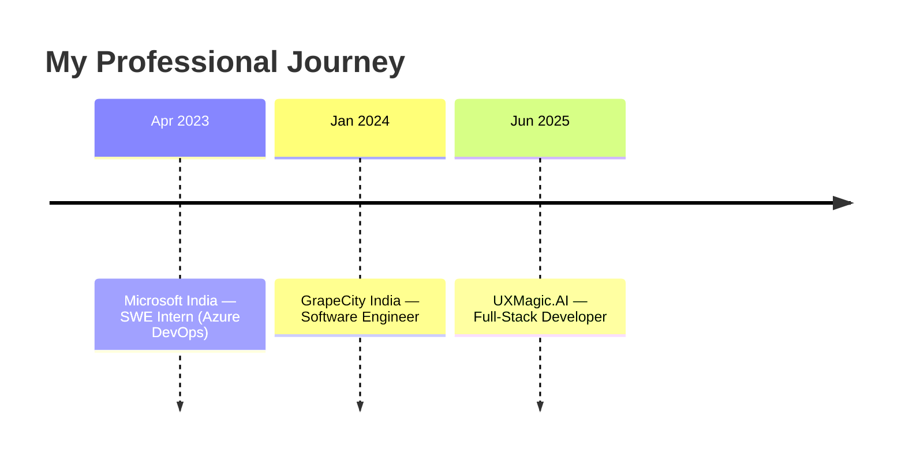

<!-- ═══════════════════════════════════════════════════════════════ -->
<!--                          HEADER BANNER                          -->
<!-- ═══════════════════════════════════════════════════════════════ -->

<div align="center">


<!-- Typing animation -->
<a href="https://surbhi-sinha.vercel.app/">
  
</a>

<br/>

<!-- Social / Profile badges -->
<a href="https://surbhi-sinha.vercel.app/">
  
</a>
<a href="https://www.linkedin.com/in/surbhi-sinha-554902176/">
  
</a>
<a href="https://medium.com/@astsurbhisinha">
  
</a>
<a href="mailto:astsurbhisinha@gmail.com">
  
</a>

<br/>

<!-- Profile views + followers -->


</div>

<!-- ═══════════════════════════════════════════════════════════════ -->
<!--                          ABOUT ME                               -->
<!-- ═══════════════════════════════════════════════════════════════ -->

## 🚀 About Me

> Passionate **full-stack developer** specializing in **backend development with Node.js, Java & Spring boot**, crafting scalable web applications with a strong focus on **innovation, efficiency, and user experience.**

```javascript
const Surbhi = () => {
  return {
    role: "Full-Stack Developer 💻",
    focus: ["Multi-agent systems", "RAG", "Scalable backends","Smooth Frontends"],
    stack: ["Node.js", "NestJS", "Next.js","JavaScript", "TypeScript", "React", "Java", "Spring Boot","C#"],
    motto: "Code. Optimize. Innovate. 🚀",
  };
};

console.log(Surbhi());
```

- 🔭 &nbsp;Currently building **Fullstack and AI-powered design tooling** with multi-agent orchestration.
- 🌱 &nbsp;Deepening my expertise in **distributed systems, microservices, AI Infrastructure & cloud architecture**
- 🧠 &nbsp;Ask me about **Node.js, NestJS, Next.js,React.js, Java, Spring Boot, MCP & Agentic programming, REST/WebSocket APIs**
- 🧩 &nbsp;Ex-**Microsoft** & **GrapeCity** engineer
- ✍️ &nbsp;I write about backend & scale in my [**blogs"**](https://medium.com/@astsurbhisinha)
- 📫 &nbsp;Reach me at **astsurbhisinha@gmail.com**
- 🌐 &nbsp;Visit my website 👉 **https://surbhi-sinha.vercel.app/**

<!-- ═══════════════════════════════════════════════════════════════ -->
<!--                          TECH STACK                             -->
<!-- ═══════════════════════════════════════════════════════════════ -->

## 🛠️ Tech Stack

### 💻 Languages
<p>
  
  
  
  
  
  
  
</p>

### ⚙️ Frameworks & Libraries
<p>
  
  
  
  
  
  
  
  
  
  
</p>

### 🤖 AI / Architecture
<p>
  
  
  
  
  
  
  
</p>

### 🗄️ Databases
<p>
  
  
  
  
</p>

### ☁️ DevOps & Deployment
<p>
  
  
  
  
  
  
  
</p>

### 🧰 Tools & Package Managers
<p>
  
  
  
  
  
  
</p>

### 🖥️ Environments & OS
<p>
  
  
  
  
  
  
</p>


<!-- ═══════════════════════════════════════════════════════════════ -->
<!--                       WORK EXPERIENCE                           -->
<!-- ═══════════════════════════════════════════════════════════════ -->

## 💼 Work Experience




<!-- ═══════════════════════════════════════════════════════════════ -->
<!--                          GITHUB STATS                           -->
<!-- ═══════════════════════════════════════════════════════════════ -->

## 📊 GitHub Analytics


<table align="center">
<tr>
<td width="50%" align="center" valign="middle">

**🔥 GitHub Streak**


</td>
<td width="50%" align="center" valign="middle">

**💡 Random Dev Quote**


</td>
</tr>
</table>


<!-- ═══════════════════════════════════════════════════════════════ -->
<!--                       CONTRIBUTION GRAPH                        -->
<!-- ═══════════════════════════════════════════════════════════════ -->

## 📈 Contribution Graph

<div align="center">


</div>


---

<div align="center">

### 💚 Show some love by starring my repositories!


</div>

<!---
Surbhi-sinha/Surbhi-sinha is a ✨ special ✨ repository because its README.md
appears on your GitHub profile. Click the Preview link to see your changes.
--->
